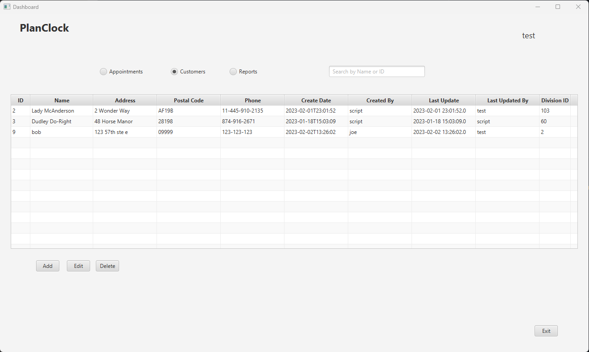

# PlanClock 
## An application that lets you manage a schedule to keep track of appointments of customers.
Author: Cesar Montalvo 
Contact: cmontalvo360@yahoo.com 
Version: 1.0  2/6/2023 
IDE: IntelliJ Community 2022.3.1 
JDK: Java 17.0.5 
JavaFX: 17.01 
MySQL Connector: mysql-connector-j 8.0.32 

To run the program you go to the "Main" class and start it from there. When started the first page will be the login page.
After you login you will be able to view all the appointments and customers.

The additional report I ran was to count the total number of appointments scheduled and total number of customers in the database.
---
This is the login screen

This is the main screen where screen where parts can be added if the fields meet certain requirments. The Modify Screen is the exact same except it's populated with data of the part you selected.

This is the customer screen where customers can be added if the fields meet certain requirments. You can also add or remove associated parts related to the product. The Modify Screen is the exact same except it's populated with data of the product you selected.
